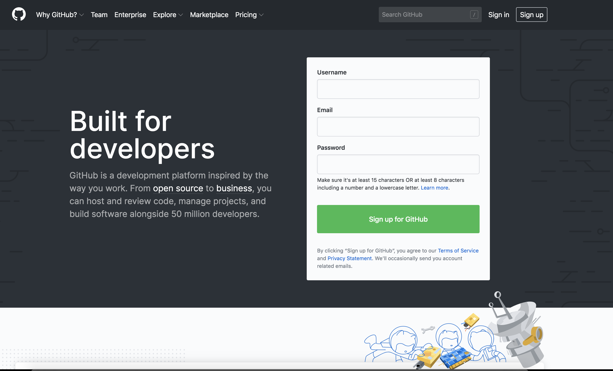
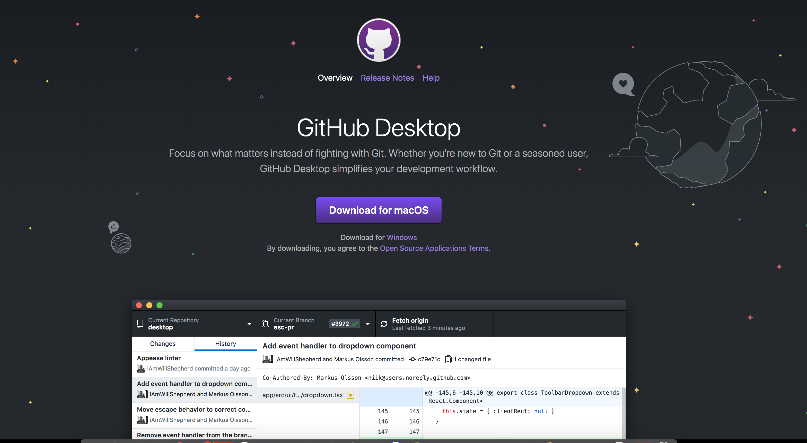

# Assignment-1
In this assignment you will create a Github account, so you can use it in this course (and hopefully in your research). You will also learn how to create a repository, branches and commit changes. Finally, you will also have to link it to the classroom assignment.

---
## Create Github Account

In a web browser open [Github's webpage](https://github.com/) and select the ``Signup for Github`` option and follow the steps to creaqte you account.
You can use your personal or institutional ``edu`` email (or both). I suggest using you personal one to ensure it stays with you no matter the circumstances. 

---
## Get Educational Benefits

Once you have created your account, get the educational benefits (free Pro account while you are a student or if you are a researcher of professor) using your ``edu`` email account.

* [Students](https://education.github.com/pack)
* [Professors and Researchers](https://education.github.com/toolbox)

---
## Download Github Utilities

Head over to [Github Desktop](https://desktop.github.com/) and download their utilities for you operating system (OS). The [Github Desktop App](https://desktop.github.com/) makes interacting with ``git`` and ``Github`` a breeze.

---
## Create your first repository and learn Github Basics

Follow the steps in [this guide](https://guides.github.com/activities/hello-world/) to create your first repository. You will also learn the basics of working with Github by creating branches, commits and pull requests. Hopefully you will see why it is so useful.

---
## Github Guides
In case you want to find out more about [Github](https://github.com/) or need some help, here are some [useful guides](https://guides.github.com/).